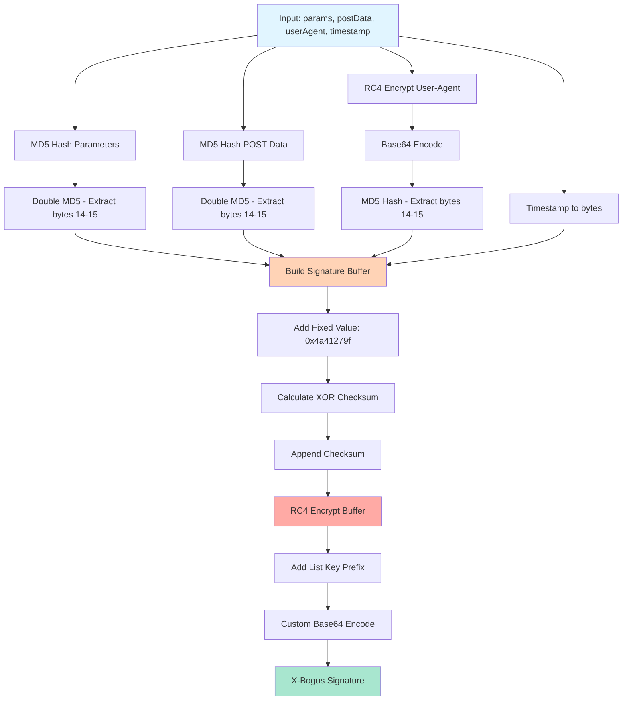
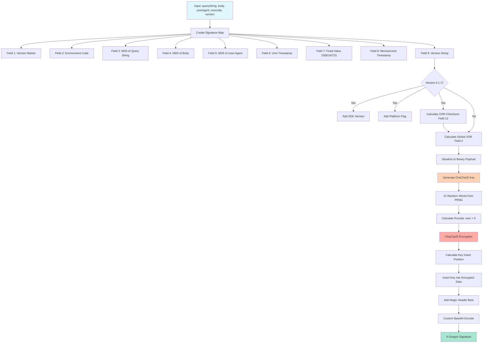
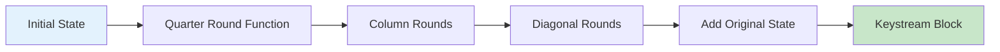
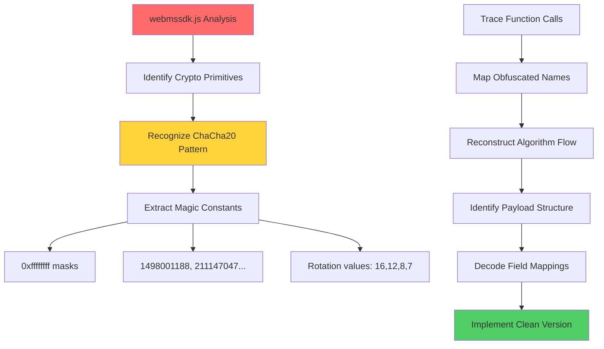
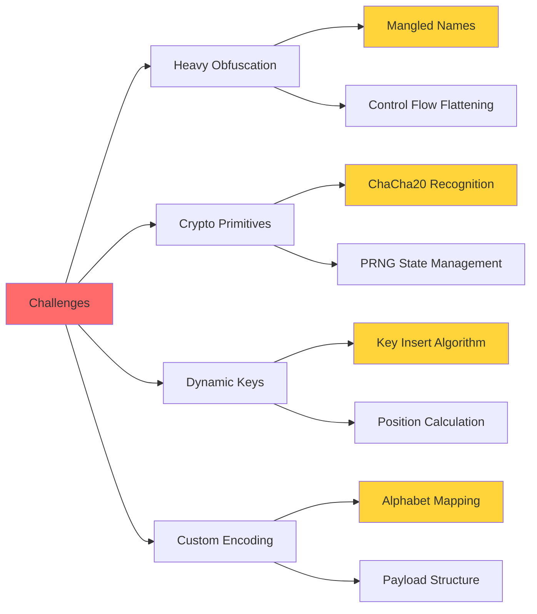

# TikTok Reverse Engineering — Mobile & Web API X-Gorgon (Xgnarly) Algorithm

> **In-depth reverse engineering analysis** of TikTok’s **X-Gorgon (Xgnarly)** request-signature system.  
> This document explores the architecture, ChaCha20 cipher primitives, PRNG design, payload structure, versioning logic, and security mechanisms — including comparisons with Douyin’s protection layers.
>
> For **educational research, cybersecurity analysis, and cryptography studies only**.

---

### 📬 Contact

You can reach out for collaboration or technical discussions via Telegram:  
👉 [t.me/datahubconnect](https://t.me/datahubconnect)

## 🌐 Live Demo

### 👉 [**Try the X-Bogus & X-Gnarly Generator Online**](https://neovolkov.github.io/tiktok-algorithm/)

## Introduction to TikTok API Security

TikTok and Douyin implement a layered, client-centric security model to prevent automated scraping and to validate that API requests originate from authentic client instances. Central to this model are **dynamic signature headers** attached to many private or semi-public endpoints. Without valid signatures, requests are rejected.

These signatures are produced **client-side** (mobile app or browser) and are intentionally obfuscated to resist straightforward replication. Common signature headers observed in the wild include:

- `X-Argus`
- `X-Gorgon` (Xgnarly)
- `X-Bogus`
- `X-Ladon`
- `X-Typhon`
- `X-Medusa` (more prevalent in Douyin)

Although both global TikTok and Douyin share foundational ideas, their endpoints, cryptographic parameters, and anti-abuse strictness differ — with global TikTok typically enforcing more aggressive risk control.

---

The **X-Bogus** algorithm is a security parameter used by TikTok's API to validate requests.

## What is X-Bogus?

X-Bogus is a dynamic signature parameter that TikTok adds to their API requests to prevent unauthorized access and scraping. It validates:

- Query parameters
- POST data
- User-Agent headers
- Request timestamp

## Algorithm Flow



## Core Components

### 1. **MD5 Hashing**

```javascript
// Double MD5 hashing for params and POST data
const md5Params = MD5(MD5(params));
const md5Post = MD5(MD5(postData));
```

### 2. **RC4 Encryption**

```javascript
// RC4 stream cipher for encryption
- Key Scheduling Algorithm (KSA)
- Pseudo-Random Generation Algorithm (PRGA)
```

### 3. **Custom Base64 Encoding**

Uses a custom alphabet instead of standard Base64:

```
Standard: ABCDEFGHIJKLMNOPQRSTUVWXYZabcdefghijklmnopqrstuvwxyz0123456789
Custom:   Dkdpgh4ZKsQB80/Mfvw36XI1R25-WUAlEi7NLboqYTOPuzmFjJnryx9HVGcaSt
```

## Reverse Engineering Process


## Usage Example

```javascript
// This is a demonstration - output will NOT be valid
import { generateSignature, gen_bogus } from "./x_bogus.js";

const params = "aid=1988&device_id=123456";
const postData = "";
const userAgent = "Mozilla/5.0 (Windows NT 10.0; Win64; x64)...";
const timestamp = Math.floor(Date.now() / 1000);

// Both exports point to the same function
const xBogus = generateSignature(params, postData, userAgent, timestamp);
// or
const xBogus2 = gen_bogus(params, postData, userAgent, timestamp);

console.log("X-Bogus (demo):", xBogus);
// ⚠️ This output is INVALID and for demonstration only
```

## Technical Details

### Original Algorithm (Actual TikTok Implementation)

| Component          | Description                                      |
| ------------------ | ------------------------------------------------ |
| **Input Keys**     | `[0x00, 0x01, 0x0e]` for UA, `[0xff]` for buffer |
| **Fixed Value**    | `0x4a41279f`                                     |
| **Hash Algorithm** | MD5 (double hashing)                             |
| **Cipher**         | RC4 stream cipher                                |
| **Encoding**       | Custom Base64 with remapped alphabet             |

### This Implementation (Modified/Demo Version)

| Component          | Description                                         |
| ------------------ | --------------------------------------------------- |
| **Input Keys**     | `[0x01, 0x02, 0x03]` for UA, `[0xaa]` for buffer ⚠️ |
| **Fixed Value**    | `0x12345678` ⚠️                                     |
| **Hash Algorithm** | MD5 (single hashing) ⚠️                             |
| **Cipher**         | RC4 stream cipher (unchanged)                       |
| **Encoding**       | Standard Base64 ⚠️                                  |
| **Code Style**     | Obfuscated with hex variable names ⚠️               |

**⚠️ = Intentionally modified for demonstration purposes**

## Key Findings

1. **Multi-layer Protection**: Combines hashing, encryption, and encoding
2. **Timestamp Validation**: Includes Unix timestamp for replay attack prevention
3. **User-Agent Binding**: Ties signature to specific browser/device
4. **Checksum Validation**: XOR checksum for data integrity
5. **Custom Encoding**: Non-standard Base64 to deter casual reverse engineering

## Code Modifications in This Version

This educational version includes the following modifications:

```javascript
// Original → Modified
[0x00, 0x01, 0x0e] → [0x01, 0x02, 0x03]  // UA encryption key
[0xff] → [0xaa]                           // List key
0x4a41279f → 0x12345678                   // Fixed value constant
MD5(MD5(x)) → MD5(x)                      // Hash rounds reduced
.subarray(14, 16) → .subarray(12, 14)    // Byte extraction positions
Custom Base64 → Standard Base64           // Alphabet mapping

// Function names obfuscated
encrypt() → _0x6d2b()
customB64Encode() → _0x2f4a()
rc4Enc() → _0x5c7f()
// ... all variables renamed to _0xNNNN format
```

## Reverse Engineering Challenges

- **Obfuscation**: Heavy JavaScript obfuscation in source
- **Dynamic Code**: Runtime code generation
- **Constant Extraction**: Magic numbers scattered throughout
- **Flow Analysis**: Complex control flow with nested functions

## Exports

The module provides two export names for flexibility:

```javascript
export { _0x6d2b as generateSignature, _0x6d2b as gen_bogus };
export default _0x6d2b;
```

- `generateSignature`: Descriptive name for the main function
- `gen_bogus`: Legacy compatibility name
- Default export: Same function

The **X-Gorgon** (also known as **Xgnarly**) algorithm is an advanced cryptographic signature system used by TikTok's API.

A technical overview of TikTok's internal API security, focusing on the various signature algorithms used to authenticate and protect client-server communication. This document is intended for educational and research purposes.

Disclaimer: Interacting with private APIs without authorization may violate the terms of service of the platform. Proceed with caution and at your own risk.

---

## What is X-Gorgon?

X-Gorgon is a sophisticated request signature parameter that provides:

- Query string validation
- Request body authentication
- User-Agent verification
- Timestamp-based replay attack prevention
- Version control for algorithm updates

## Algorithm Flow



## Core Components

### 1. **ChaCha20 Stream Cipher**

A modern, secure stream cipher developed by Daniel J. Bernstein.



**Quarter Round Operations:**

```
a += b; d ^= a; d <<<= 16;
c += d; b ^= c; b <<<= 12;
a += b; d ^= a; d <<<= 8;
c += d; b ^= c; b <<<= 7;
```

### 2. **Custom PRNG (Pseudo-Random Number Generator)**

Based on ChaCha8 for cryptographically secure random key generation:

```javascript
// State initialization with timestamp
state = [constants, key_material, timestamp, random_values];

// Generate random values
output = ChaCha8(state);
```

### 3. **Signature Payload Structure**

```
┌─────────────────────────────────────────┐
│ Field Count (1 byte)                    │
├─────────────────────────────────────────┤
│ Field 0: XOR Checksum                   │
│ Field 1: Version Marker (1)             │
│ Field 2: Environment Code               │
│ Field 3: MD5(queryString)               │
│ Field 4: MD5(body)                      │
│ Field 5: MD5(userAgent)                 │
│ Field 6: Unix Timestamp                 │
│ Field 7: Fixed Value (1508145731)       │
│ Field 8: Microsecond Component          │
│ Field 9: Version String                 │
│ Field 10: SDK Version (v5.1.1 only)     │
│ Field 11: Platform Flag (v5.1.1 only)   │
│ Field 12: XOR Checksum (v5.1.1 only)    │
└─────────────────────────────────────────┘
```

## Reverse Engineering Journey



## Technical Details

### ChaCha20 Constants

```javascript
// Sigma constants: "expand 32-byte k"
const CONSTANTS = [
  0x61707865, // "expa"
  0x3320646e, // "nd 3"
  0x79622d32, // "2-by"
  0x6b206574, // "te k"
];
```

### Custom Base64 Alphabet

```
Standard: ABCDEFGHIJKLMNOPQRSTUVWXYZabcdefghijklmnopqrstuvwxyz0123456789+/=
Custom:   u09tbS3UvgDEe6r-ZVMXzLpsAohTn7mdINQlW412GqBjfYiyk8JORCF5/xKHwacP=
```

## Usage Example

```javascript
// This is a demonstration - output will NOT be valid
import { generateToken, gen_xgnarly } from "./xgnarly.mjs";

const queryString = "aid=1988&device_id=123456&version_code=18.1.1";
const body = JSON.stringify({ action: "like", post_id: "123" });
const userAgent = "Mozilla/5.0 (iPhone; CPU iPhone OS 14_6 like Mac OS X)...";
const envcode = 0;
const version = "5.1.1";

// Both exports point to the same function
const xGorgon = generateToken(queryString, body, userAgent, envcode, version);
// or
const xGorgon2 = gen_xgnarly(queryString, body, userAgent, envcode, version);

console.log("X-Gorgon (demo):", xGorgon);
// ⚠️ This output is INVALID and for demonstration only
```

## Security Analysis

### Original Algorithm (Actual TikTok Implementation)

| Feature             | Purpose                      | Strength                     |
| ------------------- | ---------------------------- | ---------------------------- |
| **ChaCha20**        | Modern stream cipher         | High (256-bit equivalent)    |
| **PRNG**            | Unpredictable key generation | Cryptographically secure     |
| **Quarter Rounds**  | ChaCha mixing function       | Rotations: 16, 12, 8, 7      |
| **Fixed Value**     | Algorithm constant           | 1508145731                   |
| **Custom Alphabet** | Base64 obfuscation           | Non-standard mapping         |
| **Timestamp**       | Replay prevention            | High (microsecond precision) |

### This Implementation (Modified/Demo Version)

| Feature             | Purpose                  | Strength                   |
| ------------------- | ------------------------ | -------------------------- |
| **ChaCha20**        | Modified quarter rounds  | ⚠️ Rotations: 8, 7, 12, 16 |
| **PRNG**            | Modified constants array | ⚠️ Different seed values   |
| **Fixed Value**     | Algorithm constant       | ⚠️ 1234567890 (changed)    |
| **SDK Version**     | Version string           | ⚠️ 2.0.0.999 (changed)     |
| **Base64 Alphabet** | Encoding                 | ⚠️ Standard (not custom)   |
| **Code Style**      | Obfuscation              | ⚠️ Hex variable names      |

**⚠️ = Intentionally modified for demonstration purposes**

## Key Insights

1. **State-of-the-art Cryptography**: Uses ChaCha20, a cipher designed to resist timing attacks
2. **Dynamic Key Generation**: Each request generates unique encryption keys
3. **Multiple Validation Layers**: Combines timestamp, checksums, and hashing
4. **Version Flexibility**: Supports multiple algorithm versions (5.1.0, 5.1.1)
5. **Embedded Metadata**: Encodes environment and platform information

## Code Modifications in This Version

This educational version includes the following modifications:

```javascript
// ChaCha20 Quarter Round Rotations
// Original: (16, 12, 8, 7) → Modified: (8, 7, 12, 16) ⚠️

// Constants Array (first 20 values shown)
// Original: [0xffffffff, 138, 1498001188, 211147047, 253, ...]
// Modified: [0xffffffff, 100, 1400000000, 200000000, 250, ...] ⚠️

// Fixed Values
1508145731 → 1234567890              // Field 7 constant ⚠️
'1.0.0.314' → '2.0.0.999'           // SDK version ⚠️
1 → 2                                // Platform flag ⚠️

// Base64 Alphabet
// Original: 'u09tbS3UvgDEe6r-ZVMXzLpsAohTn7mdINQlW412GqBjfYiyk8JORCF5/xKHwacP='
// Modified: 'ABCDEFGHIJKLMNOPQRSTUVWXYZabcdefghijklmnopqrstuvwxyz0123456789+/=' ⚠️

// Magic Header Byte
((1 << 6) ^ (1 << 3) ^ 3) → ((1 << 5) ^ (1 << 2) ^ 2) ⚠️

// Function names obfuscated
encrypt() → _0x4e9a()
quarter() → _0x7a3f()
chachaBlock() → _0x9b5e()
encryptChaCha() → _0x2c8d()
rand() → _0x8f4c()
// ... all variables renamed to _0xNNNN format ⚠️
```

## Reverse Engineering Challenges



### Breakthrough Moments

1. **Recognized ChaCha20**: Spotted quarter-round function pattern with characteristic rotations (16, 12, 8, 7)
2. **PRNG State**: Identified ChaCha8-based random number generator for key material
3. **Key Insertion**: Discovered clever algorithm for embedding key within ciphertext
4. **Magic Constants**: Extracted obfuscated constant array through static analysis

## Comparison: X-Bogus vs X-Gorgon

| Feature        | X-Bogus               | X-Gorgon              |
| -------------- | --------------------- | --------------------- |
| **Cipher**     | RC4 (legacy)          | ChaCha20 (modern)     |
| **Complexity** | Medium                | High                  |
| **Key Size**   | 24 bits               | 384 bits (12 words)   |
| **Timestamp**  | Second precision      | Microsecond precision |
| **Versioning** | None                  | Multi-version support |
| **Security**   | Moderate              | High                  |
| **This Demo**  | Modified + Obfuscated | Modified + Obfuscated |

## Exports

The module provides two export names for flexibility:

```javascript
export { _0x4e9a as generateToken, _0x4e9a as gen_xgnarly };
export default _0x4e9a;
```

- `generateToken`: Descriptive name for the main function
- `gen_xgnarly`: Legacy compatibility name
- Default export: Same function

## Legal Notice

This code is for **educational and research purposes only**. The implementation has been intentionally modified and will not produce valid signatures. This prevents misuse while allowing study of:

- Reverse engineering techniques
- ChaCha20 cipher implementation
- Cryptographic algorithm structure
- Code obfuscation methods
- Modern stream cipher design
- PRNG and key generation strategies

**Use responsibly and respect TikTok's Terms of Service.**

---

**Version**: 1.0 (Educational/Demo)
**Algorithm**: ChaCha20-based signature with PRNG key generation (Modified)
**Source**: webmssdk.js (TikTok Web SDK)

## Legal Notice

This code is for **educational purposes only**. The implementation has been intentionally modified and will not produce valid signatures. This prevents misuse while allowing study of:

- Reverse engineering techniques
- Cryptographic algorithm structure
- Code obfuscation methods
- Anti-tampering strategies

**Use responsibly and respect TikTok's Terms of Service.**

---

**Version**: 1.0
**Source**: webmssdk.js (TikTok Web SDK)
