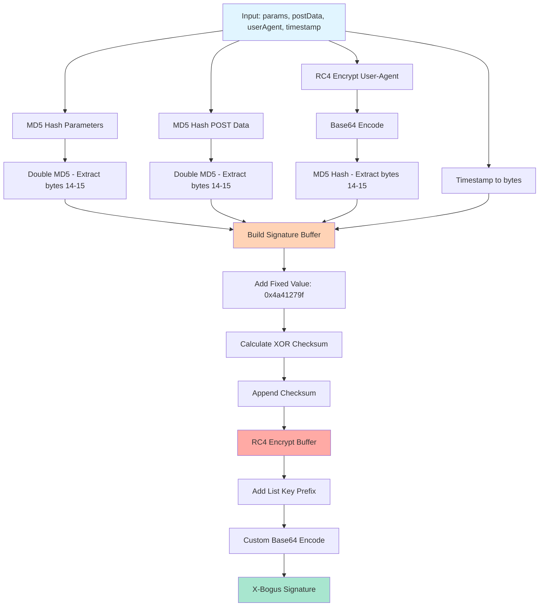
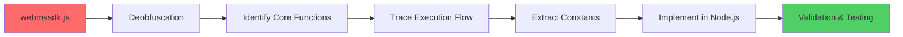

# X-Bogus Algorithm - Reverse Engineering Documentation

## Overview

The **X-Bogus** algorithm is a security parameter used by TikTok's API to validate requests.

## What is X-Bogus?

X-Bogus is a dynamic signature parameter that TikTok adds to their API requests to prevent unauthorized access and scraping. It validates:

- Query parameters
- POST data
- User-Agent headers
- Request timestamp

## Algorithm Flow



## Core Components

### 1. **MD5 Hashing**

```javascript
// Double MD5 hashing for params and POST data
const md5Params = MD5(MD5(params));
const md5Post = MD5(MD5(postData));
```

### 2. **RC4 Encryption**

```javascript
// RC4 stream cipher for encryption
- Key Scheduling Algorithm (KSA)
- Pseudo-Random Generation Algorithm (PRGA)
```

### 3. **Custom Base64 Encoding**

Uses a custom alphabet instead of standard Base64:

```
Standard: ABCDEFGHIJKLMNOPQRSTUVWXYZabcdefghijklmnopqrstuvwxyz0123456789
Custom:   Dkdpgh4ZKsQB80/Mfvw36XI1R25-WUAlEi7NLboqYTOPuzmFjJnryx9HVGcaSt
```

## Reverse Engineering Process



## Usage Example

```javascript
// This is a demonstration - output will NOT be valid
import { generateSignature, gen_bogus } from "./x_bogus.js";

const params = "aid=1988&device_id=123456";
const postData = "";
const userAgent = "Mozilla/5.0 (Windows NT 10.0; Win64; x64)...";
const timestamp = Math.floor(Date.now() / 1000);

// Both exports point to the same function
const xBogus = generateSignature(params, postData, userAgent, timestamp);
// or
const xBogus2 = gen_bogus(params, postData, userAgent, timestamp);

console.log("X-Bogus (demo):", xBogus);
// ⚠️ This output is INVALID and for demonstration only
```

## Technical Details

### Original Algorithm (Actual TikTok Implementation)

| Component          | Description                                      |
| ------------------ | ------------------------------------------------ |
| **Input Keys**     | `[0x00, 0x01, 0x0e]` for UA, `[0xff]` for buffer |
| **Fixed Value**    | `0x4a41279f`                                     |
| **Hash Algorithm** | MD5 (double hashing)                             |
| **Cipher**         | RC4 stream cipher                                |
| **Encoding**       | Custom Base64 with remapped alphabet             |

### This Implementation (Modified/Demo Version)

| Component          | Description                                         |
| ------------------ | --------------------------------------------------- |
| **Input Keys**     | `[0x01, 0x02, 0x03]` for UA, `[0xaa]` for buffer ⚠️ |
| **Fixed Value**    | `0x12345678` ⚠️                                     |
| **Hash Algorithm** | MD5 (single hashing) ⚠️                             |
| **Cipher**         | RC4 stream cipher (unchanged)                       |
| **Encoding**       | Standard Base64 ⚠️                                  |
| **Code Style**     | Obfuscated with hex variable names ⚠️               |

**⚠️ = Intentionally modified for demonstration purposes**

## Key Findings

1. **Multi-layer Protection**: Combines hashing, encryption, and encoding
2. **Timestamp Validation**: Includes Unix timestamp for replay attack prevention
3. **User-Agent Binding**: Ties signature to specific browser/device
4. **Checksum Validation**: XOR checksum for data integrity
5. **Custom Encoding**: Non-standard Base64 to deter casual reverse engineering

## Code Modifications in This Version

This educational version includes the following modifications:

```javascript
// Original → Modified
[0x00, 0x01, 0x0e] → [0x01, 0x02, 0x03]  // UA encryption key
[0xff] → [0xaa]                           // List key
0x4a41279f → 0x12345678                   // Fixed value constant
MD5(MD5(x)) → MD5(x)                      // Hash rounds reduced
.subarray(14, 16) → .subarray(12, 14)    // Byte extraction positions
Custom Base64 → Standard Base64           // Alphabet mapping

// Function names obfuscated
encrypt() → _0x6d2b()
customB64Encode() → _0x2f4a()
rc4Enc() → _0x5c7f()
// ... all variables renamed to _0xNNNN format
```

## Reverse Engineering Challenges

- **Obfuscation**: Heavy JavaScript obfuscation in source
- **Dynamic Code**: Runtime code generation
- **Constant Extraction**: Magic numbers scattered throughout
- **Flow Analysis**: Complex control flow with nested functions

## Exports

The module provides two export names for flexibility:

```javascript
export { _0x6d2b as generateSignature, _0x6d2b as gen_bogus };
export default _0x6d2b;
```

- `generateSignature`: Descriptive name for the main function
- `gen_bogus`: Legacy compatibility name
- Default export: Same function

## Legal Notice

This code is for **educational purposes only**. The implementation has been intentionally modified and will not produce valid signatures. This prevents misuse while allowing study of:

- Reverse engineering techniques
- Cryptographic algorithm structure
- Code obfuscation methods
- Anti-tampering strategies

**Use responsibly and respect TikTok's Terms of Service.**

---

**Version**: 1.0
**Source**: webmssdk.js (TikTok Web SDK)
